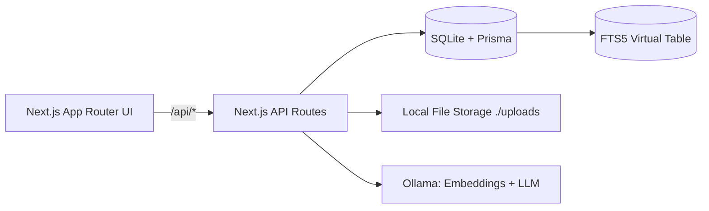
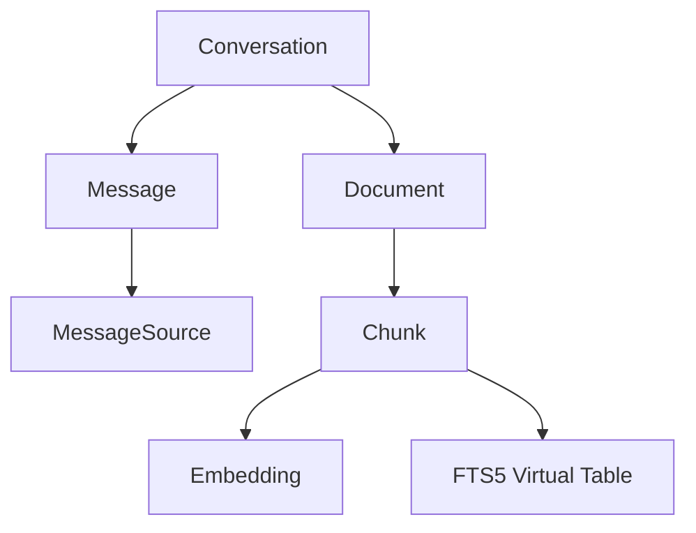

# 🧠 Second Brain — Local-First RAG App

A private, zero-cost, local-first "second brain" to search your PDFs with AI.
Runs on your machine with **Next.js + SQLite (Prisma) + Ollama**. No cloud, no API fees.

## Why this exists
We drown in notes and PDFs. Traditional search misses nuance. This app uses **hybrid retrieval** (FTS5 BM25 + semantic vectors) and a local LLM to answer questions with **citations**—fast, private, and free.

## Highlights
- **Local-first & private** – files and vectors never leave your machine
- **Hybrid search** – SQLite **FTS5** prefilter ➜ cosine similarity over embeddings
- **Streaming answers** – real-time output with a **Stop** button
- **Multi-chat** – each chat has its **own context & files**
- **Zero setup DB** – SQLite with Prisma (checked into repo)

## Architecture (high level)




## Quick Start

### 0) Requirements
- **Node.js 20+**
- **Ollama** (Windows/Linux) with models: `all-minilm` (embeddings), `llama3` (LLM)

### 1) Clone & install
```bash
git clone <your-repo-url> second-brain
cd second-brain
npm install
```

### 2) Set environment
Create `.env.local` (see all options below):
```bash
DATABASE_URL=file:./data/app.db
UPLOAD_DIR=./uploads
OLLAMA_BASE=http://localhost:11434
OLLAMA_EMBED_MODEL=all-minilm
OLLAMA_LLM_MODEL=llama3
TOP_K=5
MAX_CONTEXT_CHARS=3000
PREFILTER_LIMIT=200
```

### 3) Start Ollama & pull models

**Windows (PowerShell)**
```powershell
ollama serve
ollama pull all-minilm
ollama pull llama3
```

**Linux**
```bash
ollama serve
ollama pull all-minilm
ollama pull llama3
```

### 4) Migrate DB & run
```bash
npx prisma migrate dev
npx prisma generate
npm run dev
```

Open `http://localhost:3000`

### 5) Use it
1. **New Chat** ➜ you're in Draft (no DB row yet)
2. Click **+** to add PDFs (up to 10) ➜ auto-embedded
3. **Ask a question** ➜ streaming answer + citations
4. **Switch chats** via left sidebar; **Delete** cascades files + vectors

## Environment variables

Copy `.env.example` ➜ `.env.local` and adjust as needed.

```bash
# Database & storage
DATABASE_URL=file:./data/app.db        # SQLite file path
UPLOAD_DIR=./uploads                   # Where PDFs are stored

# Ollama
OLLAMA_BASE=http://localhost:11434
OLLAMA_EMBED_MODEL=all-minilm          # e.g., nomic-embed-text, mxbai-embed-large
OLLAMA_LLM_MODEL=llama3                # e.g., mistral, phi, gemma

# Retrieval knobs
TOP_K=5                                # chunks passed to LLM
MAX_CONTEXT_CHARS=3000                 # max context size
PREFILTER_LIMIT=200                    # FTS5 candidates before cosine
```

## Testing (manual)

- **Multi-chat nav**: Draft ➜ ask ➜ chat created. New Chat ➜ draft ➜ upload ➜ ask. Switch back ➜ history intact.
- **Delete cascade**: Delete a chat ➜ files removed from `./uploads`, rows removed from Document/Chunk/Embedding.
- **Errors**: Stop Ollama ➜ ask ➜ friendly "Ollama not running" message. Wrong model ➜ hint to `ollama pull`.
- **FTS5 fallback**: Ask something not in docs ➜ graceful "not found in notes".
- **Long PDF**: Upload a large PDF ➜ chunk/embedding completes; query latency OK.

## Performance tips

- Start with `TOP_K=5`, `MAX_CONTEXT_CHARS=2500–3000`, `PREFILTER_LIMIT=200`
- If answers seem off-topic, raise `TOP_K` slightly
- If slow before LLM, lower `PREFILTER_LIMIT`


## Cloud Demo Mode (Vercel + Supabase)

This repository supports deployment as a **read-only web demo** with pre-seeded data. Perfect for showcasing your Second Brain without allowing public uploads.

### Architecture

- **Frontend & API**: Vercel (Next.js)
- **Database**: Supabase (Postgres) with seeded data
- **AI Provider**: OpenAI or Groq (hosted, no local Ollama needed)
- **Storage**: Local metadata only (no new uploads in demo mode)

### Deployment Steps

#### 1. Export Seed Data Locally

First, populate your local database with documents and conversations you want to demo:

```bash
# Start Ollama and pull models
ollama serve
ollama pull all-minilm
ollama pull llama3

# Run locally and upload your demo PDFs
npm run dev
# Upload PDFs and create conversations

# Export seed data
node scripts/export-seed.js
```

This creates JSON files in `./docs/seed/` with all your data (conversations, documents, chunks, embeddings, messages).

#### 2. Set Up Supabase

1. Create a free Supabase project at https://supabase.com
2. Get your database connection string from Settings → Database
3. Update Prisma schema for Postgres:

```prisma
// prisma/schema.prisma
datasource db {
  provider = "postgresql"  // Change from "sqlite"
  url      = env("DATABASE_URL")
}
```

4. Set `DATABASE_URL` in your local `.env.local`:

```bash
DATABASE_URL=postgresql://postgres:[PASSWORD]@[HOST]:5432/postgres
```

5. Deploy schema to Supabase:

```bash
npx prisma migrate deploy
npx prisma generate
```

#### 3. Import Seed Data

```bash
node scripts/import-seed.js
```

Verify data imported successfully:

```bash
npx prisma studio
```

#### 4. Deploy to Vercel

1. Push your code to GitHub
2. Create a new Vercel project from your repo
3. Configure environment variables in Vercel:

```bash
# Database
DATABASE_URL=postgresql://postgres:[PASSWORD]@[HOST]:5432/postgres

# Demo Mode (disable uploads)
DEMO_MODE=true

# AI Providers (use hosted services)
PROVIDER_EMBED=openai
PROVIDER_LLM=groq

# API Keys
OPENAI_API_KEY=sk-...
GROQ_API_KEY=gsk_...

# Storage (keep local for demo)
STORAGE_DRIVER=local

# Retrieval params (optional, defaults shown)
TOP_K=5
MAX_CONTEXT_CHARS=3000
PREFILTER_LIMIT=200
```

4. Deploy!

#### 5. Verify Demo

- Visit your Vercel URL
- You should see a yellow banner: "Demo Mode: File uploads are disabled"
- Upload button should be disabled
- Conversations and documents from seed data should be available
- Queries should work using Groq/OpenAI

### Environment Variables for Production

| Variable | Required | Example | Notes |
|----------|----------|---------|-------|
| `DATABASE_URL` | ✅ | `postgresql://...` | Supabase connection string |
| `DEMO_MODE` | ✅ | `true` | Disables uploads |
| `PROVIDER_EMBED` | ✅ | `openai` | Embedding provider |
| `PROVIDER_LLM` | ✅ | `groq` | LLM provider (groq is fast & free tier friendly) |
| `OPENAI_API_KEY` | ✅ | `sk-...` | For embeddings (if using OpenAI) |
| `GROQ_API_KEY` | ✅ | `gsk_...` | For LLM (if using Groq) |
| `STORAGE_DRIVER` | ⚠️ | `local` | Keep as `local` for demo (no uploads) |
| `TOP_K` | ❌ | `5` | Optional, defaults to 5 |
| `MAX_CONTEXT_CHARS` | ❌ | `3000` | Optional |
| `PREFILTER_LIMIT` | ❌ | `200` | Optional |

### Cost Considerations

**Free Tier Friendly:**
- Supabase: 500 MB database (plenty for demo)
- Vercel: Hobby plan (free for personal projects)
- Groq: Free tier with generous limits (fast inference)
- OpenAI: Pay-as-you-go (embeddings are cheap: ~$0.0001 per 1K tokens)

**GitHub Student Pack:**
If you have GitHub Student Pack, you get extra credits for Vercel, Azure, and more.

### Switching from Demo to Production

To enable uploads in production:

1. Set `DEMO_MODE=false`
2. Configure `STORAGE_DRIVER=vercel-blob`
3. Add `VERCEL_BLOB_READ_WRITE_TOKEN` from Vercel dashboard
4. Redeploy

### Troubleshooting

**Seed import fails:**
- Ensure `DATABASE_URL` points to Postgres, not SQLite
- Run `npx prisma migrate deploy` first
- Check for foreign key violations (import order matters)

**Queries don't work:**
- Verify `OPENAI_API_KEY` or `GROQ_API_KEY` is set
- Check Vercel function logs for errors
- Ensure embeddings were imported (check `Embedding` table in Prisma Studio)

**Prisma schema mismatch:**
- After changing `provider` in schema, run `npx prisma generate`
- Delete `node_modules/.prisma` and regenerate if needed

## Roadmap (post-V1)

- OCR for scanned PDFs
- Conversation rename/pin
- Export chat as Markdown with sources
- Vercel Blob storage integration for cloud uploads